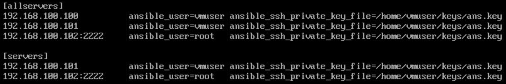

Continue
===========

Пользователь Ansible создаёт определённые «плейбуки» (playbook) в формате YAML с описанием требуемых состояний управляемой системы. «Плейбук» — это описание состояния ресурсов системы, в котором она должна находиться в конкретный момент времени, включая установленные пакеты, запущенные службы, созданные файлы и многое другое. Ansible проверяет, что каждый из ресурсов системы находится в ожидаемом состоянии и пытается исправить состояние ресурса, если оно не соответствует ожидаемому.

Для выполнения задач используется система модулей. Каждая задача представляет собой имя задачи, используемый модуль и список параметров, характеризующих задачу. Система Ansible поддерживает переменные, фильтры обработки переменных (поддержка осуществляется библиотекой Jinja2), условное выполнение задач, параллелизацию, шаблоны файлов. Адреса и настройки целевых систем содержатся в файлах «инвентаря» (inventory). Поддерживается группирование. Для реализации набора сходных задач существует система ролей. 

Подключение к удаленным узлам

Ansible взаимодействует с удаленными машинами по протоколу SSH. По умолчанию Ansible использует собственный OpenSSH и подключается к удаленным машинам, используя ваше текущее имя пользователя, так же, как и ОНА.
Действие: проверьте свои SSH-соединения

Подтвердите, что вы можете подключиться по SSH ко всем узлам в вашем инвентаре, используя одно и то же имя пользователя. При необходимости добавьте свой открытый SSH-ключ в файл authorized_keys в этих системах.

Пример

На компьютерах предприятии установлены ОС Centos и Debian.
Centos  - 192.168.0.10 - 192.168.0.20
Debian - 192.168.0.21 - 192.168.0.30
С помощью ansible, установленного на SRV (Centos8) создать сценарии автоматизации работы:

1) по установке программного обеспечения: lynx,vim,curl,tcpdump,wget

Решение:

1. На всех клиентах 

Обозначения:

SRV: Сервер ansible - компьютер с установленным ansible
Клиент - управляемое устройство

Настройка подключение по SSH
"""""""""""""""""""""""""""""

::

	vim /etc/ssh/sshd_config
	Port 22
	PermitRootLogin yes
	PubkeyAuthentication yes
	AuthorizedKeysFile     .ssh/authorized_keys .ssh/authorized_keys2

	systemctl restart sshd

если необходимо 

::

	setenforce 0
	
Создать на клиентах и сервере (на котором установлен  ansible) учетную запись, под которой будет выполняться управление работой (например **ansible**):

::
	useradd ansible
	passwd ansible
	
Дать право пользователю **ansible** на беспарольный запуск sudo команд

::

	visudo

	ansible ALL=(ALL) NOPASSWD:ALL
	
Сгенерировать ключ на сервере

::

	ssh-keygen-t rsa -b 4096
	
Скопировать ключ на клиентов

::

	ssh-copy-id ip_client
	
Заполнить инвентарный файл (используется при выполнении сценариев)

по умолчанию /etc/ansible/hosts

::

	[centos]
	ip1
	ip2
	ip3
	FQDN1
	FQDN2
	FQDN3

	[debian]
	ip1
	ip2
	ip3

	FQDN1
	FQDN2
	FQDN3

группы **all** и **ungrouped** - группы по умолчанию *Все и “все, кто не в группе”*

.. figure:: inv01.png
	:scale: 100%
	:align: center
	

если необходимо разместить инвентраный файл в другом каталоге, то необходимо указать путь в /etc/ansible/ansible.cfg

Раздел [default]
* inventory=<Путь>
* Можно использовать $HOME

::
	[default]
	inventory = $HOME/hosts
	...
	

**Проверка связи:**

::
	
	ansible all -m ping

**Модули Ansible: установка ПО**

::

	ansible.builtin.package:
		- name: <Имя пакета>
		- state: <Состояние>

	* Возможные состояния:

		present - установка
		absent - удаление

Пример:

::

	vim instsoft.yaml

::

	- name: Install software
	  hosts: centos
	  become:yes
	  tasks:
		- name: Install tcpdump
		ansible.builtin.package:
			name: tcpdump
			state: present
		- name: Remove firewalld
		  ansible.builtin.package
			name: firewalld
			state: absent

::

	ansible-playbook instsoft.yaml
	
	
.. note:: Возможне причины неправильной работы: запуск playbook без sudo, неправильное имя пакета, нет ключа 

::

	yum:
		name: <Имя пакета>
		state: <Состояние>
		enablerepo: <Репозиторий>
	Возможные состояния
		absent - удален
		installed - установлен
		latest - обновлен
		
		
		
::

	- name: Install software
	  hosts: centos
	  become:yes
	  tasks:
		- name: Install Apache on C8
		  yum:
			name: httpd
			state: installed
		- name: Remove soft
		  yum:
			name: firewalld
			state: absent
			
**Ansible: управление службами	**	

::

	ansible.builtin.systemd:
		name: <Имя службы>
		state: <Состояние>
		enabled: < yes | no >
		daemon_reload: < yes | no >
	Cостояния
		reloaded / restarted /
		started / stopped
		Автозапуск: yes / no
		Обновление конфигурации			
		
Пример:

::
	
	- name: Install software
	  hosts: centos
	  become:yes
	  tasks:	
		- name: Start apache
		  ansible.builtin.systemd:
			name: httpd
			state: started
		- name: Ensure autostart BIND
		  ansible.builtin.systemd:
			name: named
			state: started
			enable: yes

**Проверка сценария**

--list-hosts

Перечисление хостов, на которых будет выполнен сценарий

--list-tasks

Перечисление задач к выполнению

--syntax-check

Проверка синтаксиса

**Применение переменных**

" {{ <Переменная> }} "

* Применяется в файлах сценария и шаблонах
* На момент вызова должна быть определена

Установка значения:

::

	ansible-playbook -e <Переменная>=<Значение>
	
Может быть указана в inventory

::

	[centos]
	ip1
	ip2
	ip3
	
	[centos:vars]
	target_package = httpd
	
	[debian]
	ip1
	ip2
	ip3
	
	[debian:vars]
	target_package = apache2
	
Использование:

::
	vim variablesoft.yaml
	
	- name: Install software
	  hosts: all
	  become:yes
	  tasks:
		- name: Install apache
		  ansible.builtin.package:
			name: "{{ target_package }}"
			state: present

::

	ansible-playbook variablesoft.yaml

