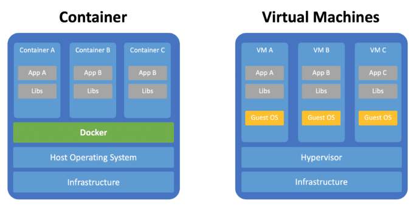
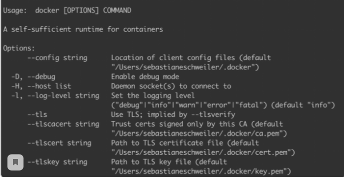
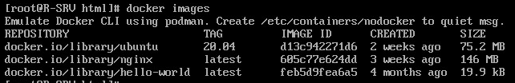

Контейнеризация и Docker
""""""""""""""""""""""""""""

**Контейнеризация** (виртуализация на уровне операционной системы, контейнерная виртуализация, зонная виртуализация) — метод виртуализации, при котором ядро операционной системы поддерживает несколько изолированных экземпляров пространства пользователя вместо одного. Эти экземпляры (обычно называемые контейнерами или зонами) с точки зрения выполняемых в них процессов идентичны отдельному экземпляру операционной системы.  Ядро обеспечивает полную изолированность контейнеров, поэтому программы из разных контейнеров не могут воздействовать друг на друга.

В отличие от аппаратной виртуализации, при которой эмулируется аппаратное окружение и может быть запущен широкий спектр гостевых операционных систем, в контейнере может быть запущен экземпляр операционной системы только с тем же ядром, что и у хостовой операционной системы (все контейнеры узла используют общее ядро). При этом при контейнеризации отсутствуют дополнительные ресурсные накладные расходы на эмуляцию виртуального оборудования и запуск полноценного экземпляра операционной системы, характерные при аппаратной виртуализации.

Существуют реализации, ориентированные на создание практически полноценных экземпляров операционных систем (Solaris Containers, контейнеры Virtuozzo, OpenVZ), так и варианты, фокусирующиеся на изоляции отдельных сервисов с минимальным операционным окружением (jail, Docker).

**Docker** — программное обеспечение для автоматизации развёртывания и управления приложениями в средах с поддержкой контейнеризации, контейнеризатор приложений. Позволяет «упаковать» приложение со всем его окружением и зависимостями в контейнер, который может быть развёрнут на любой Linux-системе с поддержкой контрольных групп в ядре, а также предоставляет набор команд для управления этими контейнерами.
Разрабатывается и поддерживается одноимённой компанией-стартапом, распространяется в двух редакциях — общественной (Community Edition) по лицензии Apache 2.0 и для организаций (Enterprise Edition) по проприетарной лицензии. Написан на языке Go.

Подробнее: https://ru.wikipedia.org/wiki/Docker

Контейнерная платформа Docker всегда работает поверх операционной системы хоста. Контейнеры содержат двоичные файлы, библиотеки и само приложение. Контейнеры не содержат гостевой операционной системы, которая обеспечивает легкий вес контейнеров.
Напротив, виртуальные машины работают на гипервизоре (отвечает за запуск виртуальных машин) и включают собственную гостевую операционную систему. Это значительно увеличило размер виртуальных машин, усложнило настройку виртуальных машин и потребовало больше ресурсов для запуска каждой виртуальной машины.

Docker используется с целью получения работоспособных приложений, совместимого со всеми популярными операционными системами. Конфигурация приложения собирается автоматически и код выполняется всегда, даже при отсутствии необходимого окружения и установленного программного обеспечения.

Image (Изображения)
~~~~~~~~~~~~~~~~~~~~~~~
**Image** Docker содержит все необходимое для запуска приложения в качестве контейнера. Это включает в себя:

* библиотеки кода
* среды выполнения переменные
* среды файлы конфигурации
  
Затем образ может быть развернут в любой среде Docker и выполнен в виде контейнера. Docker имеет различные образы ПО: ubuntu, php (который наследуется от оригинального образа Ubuntu), nodejs, и т.д.

.. note:: Image - это шаблон 

Контейнер
~~~~~~~~~~~~~~

**Контейнер Docker** - это экземпляр образа во время выполнения. Из одного изображения вы можете создать несколько контейнеров (все под управлением примера приложения) на нескольких платформах Docker. Контейнер выполняется как отдельный процесс на главной машине. Поскольку контейнер запускается без необходимости загрузки гостевой операционной системы, он имеет небольшой вес и ограничивает ресурсы (например, память), необходимые для его запуска. Контейнер является полностью независимым и изолированным от основной операционной системы, аналогично виртуальной операционной системе. Можно вносить любые изменения внутри , и никакие из этих изменений не повлияют на основную операционную систему.

Установка Docker
""""""""""""""""""""""

Docker доступен для любой из операционных систем: Windows, Linux, Maс.

**Centos:**

::

        yum install docker

        docker --help

Установка Docker в качестве службы
~~~~~~~~~~~~~~~~~~~~~~~~~~~~~~~~~~~~~

::

        yum -y update && yum -y upgrade
        curl -fsSL https://get.docker.com/ | sh
        systemctl start docker
        systemctl enable docker
        systemctl status docker

КОМАНДА CURL

https://losst.ru/kak-polzovatsya-curl

Версия docker

::

        docker version

**Выбор Image**

Теперь, когда Docker запущен и запущен, можно готовы выбрать изображение, чтобы запустить контейнер docker. Чтобы выбрать из списка уже существующих изображений Docker, перейдите по hub.docker.com:

Скачивание образа
~~~~~~~~~~~~~~~~~~~~~

::

        docker pull <IMAGE_NAME>, где <IMAGE_NAME> - имя скачиваемого образа

Например:

::

        docker pull ubuntu:20.04

Эта команда сообщает Докеру о том, что нужно скачать образ Ubuntu 20.04 с Dockerhub.com - основной репозиторий Docker-образов

Просмотр образа
~~~~~~~~~~~~~~~~~

::

        docker images

Удаление образа
~~~~~~~~~~~~~~~~~~~~

::

        docker rmi <IMAGE_ID>

.. figure:: img/docker_06.png
       :scale: 100 %
       :align: center
       :alt: asda

Запуск контейнера
~~~~~~~~~~~~~~~~~~~~~~

::

        docker run <image> <опциональная команды, которая выполнится внутри контейнера>

        docker run ubuntu:20.04 echo 'Ubuntu in docker'

Список запущенных контейнеров
~~~~~~~~~~~~~~~~~~~~~~~~~~~~~~~~~

Активных:

::

        docker ps

Всех:

::
  
        docker ps -a

После выполнения нужных операций внутри контейнера, Docker-контейнер завершает работу.
Каждый раз, команда **docker run**, создавает новый контейнер, на каждую из выполненных команд.

Выполнение неограниченное количество команда внутри контейнера
~~~~~~~~~~~~~~~~~~~~~~~~~~~~~~~~~~~~~~~~~~~~~~~~~~~~~~~~~~~~~~~~~~~~

::

        docker run -it ubuntu:20.04 /bin/bash

Опция **-it** - преход в конвейер

**/bin/bash** выполнение команды при входе в контейнер (даёт доступ к выполнению команд в терминале внутри контейнера Ubuntu.)

::

        docker ps -a   # просмотрим список активных контейнеров 
        docker stop aa1463167766   # остановить активный контейнер
        docker rm aa1463167766     # удалить контейнер
        docker rm bb597feb7fbe     # удалить второй контейнер
        docker ps a   # просмотрим список активных контейнеров 
        docker rm -a   # удалить все контейнеры 

Создание приложения и образа для Docker
""""""""""""""""""""""""""""""""""""""""""

Dockerfile
~~~~~~~~~~~~

Dockerfile - это обычный конфигурационный файл, описывающий пошаговое создание среды приложения. В этом файле подробно описывается, какие команды будут выполнены, какие образы задействованы, и какие настройки будут применены. А движок Docker-а при запуске уже распарсит этот файл (именуемый как Dockerfile), и создаст из него соответствующий образ (Image), который был описан.

Быстрый пример с Python

::

        vim index.py

code-block:: python

        print('Hello from Python in DOCKER!')

::

        vim Dockerfile

        FROM python
        WORKDIR /app
        COPY . /app
        CMD ["python", "index.py"]

* FROM - использовать готовый образ 
* WORKDIR - задать рабочую директорию в контейнере 
* COPY - Копирует файл с основной системы в контейнер (копируем все файлы внутрь контейнера)
* RUN - Выполнение shell-команды из терминала контейнера
* CMD - Выполняет эту команду каждый раз, при новом запуске контейнера

Для создания образа из Dockerfile нужно выполнить:

::

        docker build <DOCKERFILE_PATH> --tag <IMAGE_NAME>

        <DOCKERFILE_PATH> - путь к файлу Dockerfile (. - текущая директория),

        <IMAGE_NAME> - имя, под которым образ будет создан

При том, что имя файла Dockerfile при указывании пути упускается, нужно указывать только директорию, в которой этот файл находится (а . означает, что файл находится в той директории, из которой была запущена консоль)

::
        
        docker build . --tag hello_python

.. figure:: img/docker_04.png
       :scale: 100 %
       :align: center
       :alt: asda

::
        
        docker image ls

        docker run hello_python

Список всех команд:

https://docs.docker.com/engine/reference/builder/#from

Монтирование локальной директории в Docker-контейнер
"""""""""""""""""""""""""""""""""""""""""""""""""""""

Монтирование директории в Docker контейнер - это предоставление доступа контейнеру на чтение содержимого вашей папки из основной операционной системы. Помимо чтения из этой папки, так же, контейнер может её изменять, и такая связь является двусторонней: при изменении файлов в основной ОС изменения будут видны в контейнере, и наоборот.

**Синтаксис:**

::

        docker run -v <DIRECTORY>:<CONTAINER_DIRECTORY>:z ...,

* **DIRECTORY** - это путь к папке, которую нужно смонтировать
* **CONTAINER_DIRECTORY** - путь внутри контейнера.
* **:z** - указывает, что содержимое привязки монтирования является общим для нескольких контейнеров.

.. note:: путь к монтируемой папке должен быть прописан полностью: C:\projects\docker-example, или на **nix**-системах можно воспользоваться конструкцией $(pwd) 

Пример:

Команда:

::

        docker run -it -v ~/image01:/app hello_python /bin/bash

Создает контейнер и монтирует каталог **~/image01** в каталог **/app** контейнера

.. figure:: img/docker_05.png
       :scale: 100 %
       :align: center
       :alt: asda

Это удобная особенность, которая позволяет выполнять редактирование кода в редакторе на основной ОС, а изменения будут сразу же применяться внутри контейнера.

Порты контейнеров
"""""""""""""""""""""""

Docker позволяет получить доступ к какому-то из портов контейнера, пробросив его наружу (в основную операционную систему). По умолчанию, нет возможности получить доступ к каким-либо из портов контейнера. Однако, в Dockerfile опция EXPOSE позволяет объявить, к какому из портов можно обратиться из основной ОС.

::

        docker run -p <HOST_PORT>:<CONTAINER_PORT>

Пример: 

Создать образ для работы apache  с установленным php и зауспустить в контейнере. Обращение к apache из сети опеспечить через обращение к хостовой машине на порту 8080

1. Создать и перейти в каталог html:

::

        mkdir html
        cd html

Создать индексный файл index.php:
        
::
        
        <?php
                echo 'Hello from DOCKER-apache. We have PHP version = ' . phpversion() . PHP_EOL;
        ?>
        

2.  Создать Dockerfile:

::

        FROM php:7.2-apache
        WORKDIR /var/www/html
        COPY . /var/www/html
        #Прокинуть системный порт (Expose)
        EXPOSE 80

EXPOSE в Dockerfile разрешает подключение к 80 порту контейнера.

3. Собрать обрз

::

        docker build . --tag own_php_apache

4. Запустить контейнер

::

        docker run own_php_apache -p 80:80

