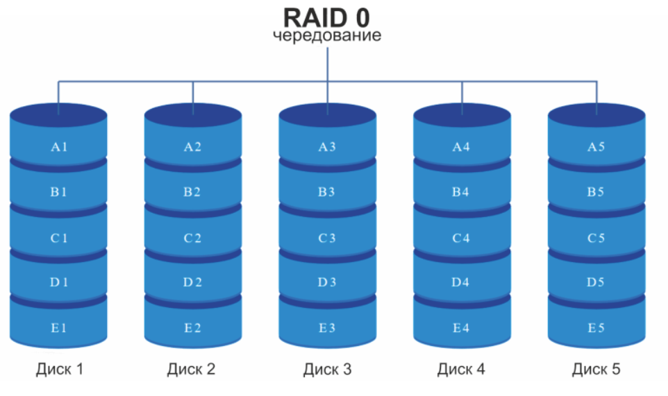
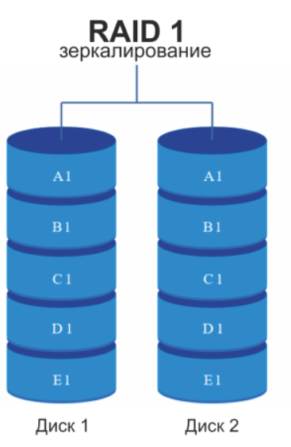
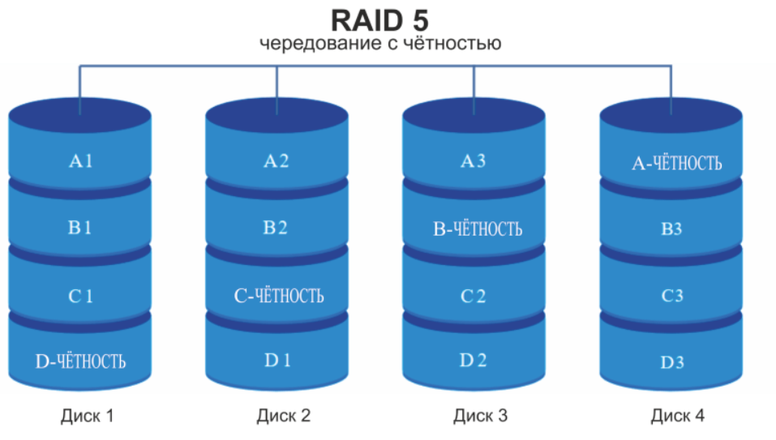
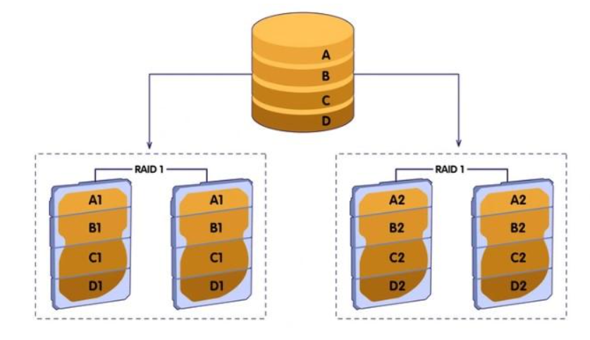

**RAID** (англ. Redundant Array of Independent Disks — избыточный массив независимых (самостоятельных) дисков) — 
технология виртуализации данных для объединения нескольких физических дисковых устройств в логический модуль 
для повышения отказоустойчивости и (или) производительности.

RAID позволяет сформировать из независимых дисковых накопителей единый логический элемент 
с целью повышения производительности и отказоустойчивости каждого отдельно взятого компонента в массиве.

Основные характеристики технологии
************************************

Области применения
======================

RAID – технология, которая дает возможность превратить несколько дисковых накопителей в один объемный и быстрый диск. 
Она применяется для организации хранилищ данных с функциями автоматического резервного копирования или при настройке системного диска с улучшенной отказоустойчивостью.

RAID-технологии используются в самых разных областях:

* системное администрирование;
* резервное копирование данных;
* получение крупных дисков с высокой скоростью обработки информации;
* работа с BigData;
* клиент-серверные модели.

RAID массивы имеют преимущества и недостатки. 
Быстродействие и надежность могут перекрываться усложнением имеющейся системы и необходимостью приобретения дополнительного оборудования. 

Преимущества и недостатки
==========================

**Преимущества:**

* Увеличение объема диска. Первоначальное предназначение рассматриваемой технологии – это получение диска большей емкости.
* Повышение быстродействия системы. Достигается за счет параллельного подключения в массив нескольких физических дисков.
* Надежность хранения документов и отказоустойчивость. Результат достигается за счет выделения на резервирование отдельного оборудования. Если один из дисков будет поврежден, RAID-массив не потеряет данные.

**Недостатки:**

 
К минусам RAID обычно относят стоимость обеспечения соответствующей системы и сложности ее организации.
Также необходимо учитывать, что такие массивы могут применяться не всегда.

Условия для применения
=======================

Чтобы воспользоваться RAID массивами, необходимо обеспечить их аппаратную и программную поддержку. В BIOS должны быть специальные настройки. Они имеют вид типа «SATA Configuration: RAID». Если соответствующий параметр отсутствует, базовую систему ввода-вывода придется «перепрошивать».

При отсутствии поддержки RAID программным методом, необходимо подключать дополнительное оборудование. Оно называется RAID-контроллер. На компьютер дополнительно устанавливается соответствующий драйвер. Последние версии Linux поддерживают автоматическую инициализацию драйверов для активации RAID-режима.

Основные определения
=====================

* Массив. Представляет собой объединение нескольких физических или виртуальных накопителей в один объемный диск. Полученный элемент поддерживает возможность целостной настройки, форматирования и управления.
* Метод зеркалирования. Способ повышения надежности хранения информации за счет создания копий исходного диска на другом носителе, включенном в массив.
* Дуплекс. Метод зеркалирования. Он поддерживает вдвое большее количество накопителей для создания копий.
* Чередование. Это увеличение производительности диска за счет блочной разбивки данных в процессе их первичной записи.
* Четность. Так называется технология, включающая в себя чередование и зеркалирование.

Типы RAID:
===========

* Программный (software). Является самым бюджетным и наиболее распространенным вариантом. Массивы здесь будут создаваться в самой операционной системе за счет применения специальных утилит. Обработка данных осуществляется центральным процессором. Ключевым недостатком технологии служит зависимость от предустановленной системы. Это приводит к сильному снижению быстродействия и безопасности хранения документов.
* Аппаратный (hardware). Базируется на основе отдельного устройства – RAID-контроллера. Он поддерживает собственный микропроцессор и кэш-память. Нагрузка на микропроцессор минимальна. Данный тип является самым затратным в плане реализации. Он характеризуется высокой скоростью чтения и записи, а также хорошей степенью защиты.
* Интегрированный аппаратный (fake RAID или RAID-on-Chip). Представляет собой сочетание программного и аппаратного типов. Реализуется дополнительными микрочипами, которые вставляются в материнскую плату и работают вместе с центральным процессором оборудования. Такая технология быстрее программной, но она уступает в плане надежности хранения информации на диске.

Классификация RAID по уровням
******************************

Основные отличия между конфигурациями или уровнями RAID заключаются в методах формирования и размещения данных, 
а также в алгоритмах распределения информации на носителях. Базовые типы RAID-массивов — RAID 0 и RAID 1. 
Остальные уровни считаются их производными, сочетающими в себе достоинства той или иной базовой модели.

RAID 0
==========

Технология виртуализации RAID 0 называется **striping** («чередование»). 
Для ее реализации применяется от 2 до 4 накопителей, которые совместно выполняют процедуру «чтения/записи».

При записи информация разделяется на блоки, которые одновременно сохраняются на накопители. П
ервый блок — на один, второй — на другой жесткий диск и так далее. 
Производительность массива возрастает прямо пропорционально количеству накопителей в системе. То есть, 4 диска будут работать в 2 раза быстрее, чем два.

Однако, такая конфигурация RAID-массива чревата потерей данных, что уменьшает безопасность хранения информации. 
Это объясняется структурой каждого файла. Последний состоит из определенной последовательности блоков (байт), 
поскольку каждый из них записывается на разные диски и происходит «нарушение» его целостности. 
Если один накопитель выходит из строя, то блок «теряется». При этом получается «битый» файл, который практически невозможно восстановить.

**Достоинства**

* Дисковый RAID-массив уровня 0 обеспечивает ощутимый прирост скорости, который прямо пропорционально зависит от кратности количества накопителей.
* Использование всего дискового объема, т. е. при установке четырех дисков по 2 ТБ общий объем RAID-массива будет равен 2*4=8 ТБ.

**Недостатки**

* Нарушение отказоустойчивости. Иногда возможен отказ в операциях чтения или записи.
* При выходе из строя одного накопителя информация полностью теряется.

**Использование**

Применяется в приложениях для скоростного обмена информацией, в хранилищах временных файлов. 
Также RAID 0 нужен для систем, использующих некритичные по важности массивы данных.

RAID 1
=========

Технология RAID 1 
называется **мirroring** («зеркалирование»). Она подразумевает использование от 2 до 4 накопителей. 
Однако при этом теряется половина объема дисков, поскольку это пространство используется резервированием данных.

Если RAID-система состоит из 2 жестких дисков, то при выходе одного из них информация не потеряется полностью, поскольку один накопитель является точной копией другого.

**Достоинства**

* Надежность хранения информации.
* Простота реализации.
* Высокая производительность при выполнении операции чтения.
* Минимальная комплектация составляет всего 2 жестких диска.

**Недостатки**

* Низкая производительность.
* Емкость RAID-массива делится на 2, что обусловлено резервированием информации.
* Замена неисправного накопителя требует полное отключение системы.

**Использование**

Уровень RAID 1 необходимо применять для увеличения надежности хранения информации на серверах.

RAID 5
=========

	   
Технология RAID 5 («чередование с чётностью») считается наиболее распространенной и безопасной. 
Для подобной конфигурации необходимо минимум 3 диска, а максимальное допустимое количество — 16.

При записи информации происходит разделение на блоки данных, но с одним условием — на один из дисков, называемый блок «чётность данных» (Parity Drive, PD), 
происходит запись информации для восстановления. Этот подход позволяет спасти данные при повреждении одного из накопителей.

RAID 5 может реализовываться программным методом при помощи специальных утилит, но рекомендуется аппаратный способ.

**Достоинства**

* Увеличена скорость чтения за счет одновременной обработки данных с нескольких независимых потоков от дисков массива.
* Информация не «потеряется» при повреждении одного накопителя.
* При замене неисправного диска происходит автоматическое восстановление информации.

**Недостатки**

* Иногда происходят отказы дисков.
* Если объем поврежденного накопителя 4 ТБ и более, при замене его на идентичный диск, восстановление может занять более одного дня.
* Если диск «чётности» вышел из строя при выполнении процедуры восстановления, то информация будет окончательно утеряна.
* Минимальное количество накопителей — 3.

**Использование**

* файловые сервера;
* сервера общего хранения;
* сервера резервного копирования;
* работа с потоковой информацией;
* разнообразные среды, требующие хорошей производительности.

Чем больше накопителей в массиве, тем больше окажется объем системы. 
Скорость чтения у RAID 5 высокая. Нагрузка на все диски raid массива распределяется равномерно.

Если один диск выходит из строя, надежность системы значительно сокращается. Массив переходит в критическое состояние. 
Его восстановление – длительный процесс, вызывающий снижение производительности и увеличивающий нагрузку на накопители. Связано это с продолжительным и интенсивным чтением.

Rebuild увеличивает шансы выхода из строя еще одного или нескольких дисков в массиве. 
Это влечет за собой потерю данных. При восстановлении информации могут возникать не выявленные ранее ошибки.

Работая с RAID 5, необходимо проводить анализ состояния накопителей (S.M.A.R.T.), 
а также пользоваться технологиями Hot Spare (горячий резерв). 
В массив будет автоматически подхватываться заранее зарезервированный диск вместо вышедшего из строя.

Комбинированные уровни
===========================

К комбинированным уровням относят сочетания «базовых» массивов. Они являются более совершенными.

RAID 01 и RAID10
-------------------

Эти массивы сочетают в себе уровни 0 и 1. RAID 01 – зеркалирование двух виртуализаций чередования. Данный уровень называется «зеркалом страйпов».

	   
RAID 10 – чередование двух зеркальных «хранилищ».

	   
Полезный объем массива – 50 % от суммарного объема всех используемых дисков.

RAID 01 и RAID10 обладают одинаковой производительностью. 
У 10 райда надежность выше, чем у 01. Результат достигается за счет того, что в RAID10 возможен отказ по одному диску в каждом «зеркале» без потери исходных данных. 
Из-за этого RAID 01 не используется.

RAID 10 включает в себя не менее 4-х дисков. 
Этот уровень заимствовал у 0 уровня скорость и у 1 – отказоустойчивость. 
Организация массива окажется дорогостоящей. RAID массив 10 идеально подходит для хранения критически важных данных в приложениях с активным вводом-выводом.

Перед выбором соответствующей конфигурации RAID-массива, специалисты рекомендуют сохранить информацию на отдельный носитель. При создании или удалении RAID-системы данные на дисках уничтожаются.

Программное обеспечение
***********************

Mdadm
==========

Для операционных систем на основе Linux рекомендуется использовать штатную утилиту «mdadm», которую необходимо предварительно установить.

**Основные возможности**

* Создание и сброс RAID-массивов.
* Монтирование файловых систем.
* Сохранение топологии массива.
* Удаление отдельных элементов из RAID.