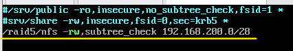
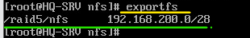
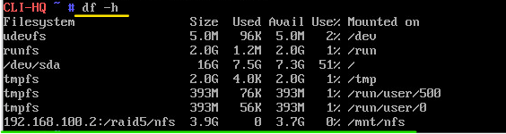
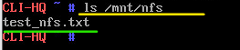

Настройка сервера сетевой файловой системы
###########################################

Задание
*********

На HQ-SRV настроить сервер сетевой файловой системы(nfs), в качестве папки 
общего доступа выбрать /raid5/nfs, доступ для чтения и записи для всей сети 
в сторону HQ-CLI  

Настройка сервера
====================

**HQ-SRV**

1. Установить программное обеспечение

.. code::
	
	apt-get install nfs-server
	
2. Запустить службы:

.. code::

	systemctl enable --now nfs

3. Cоздать каталог для общего доступа:

.. code::

	mkdir /raid5/nfs

4. Отредактировать файл **/etc/exports**, в котором хранятся настройки каталогов NFS.

.. code::

	vim /etc/exports
	
В файле /etc/exports следует указать экспортируемые каталоги (каталоги, которые будет разрешено монтировать с других машин) и IP, с которых будет доступ:

или так:

.. code::

	/raid5/nfs 192.168.200.0/28(rw,subtree_check)
	
**Примечание:** 

* Между адресом и скобками с параметрами не должно быть пробела
* /raid5/nfs - каталог для общего доступа
* 192.168.200.0/28- адрес сети, для которой разрешен доступ
* (rw) - параметры доступа
* без subtree_check/no_subtree_check доступа не будет

**Параметры доступа**

В скобках можно указать следующие параметры:

* rw - разрешить чтение и запись в этой папке;
* ro - разрешить только чтение;
* sync - отвечать на следующие запросы только тогда, когда данные будут сохранены на диск (по умолчанию);
* async - не блокировать подключения пока данные записываются на диск;
* secure - использовать для соединения только порты ниже 1024;
* insecure - использовать любые порты;
* nohide - не скрывать поддиректории при открытии доступа к нескольким директориям;
* root_squash - подменять запросы от root на анонимные, используется по умолчанию;
* no_root_squash - не подменять запросы от root на анонимные;
* all_squash - превращать все запросы в анонимные;
* subtree_check - проверять не пытается ли пользователь выйти за пределы экспортированной папки;
* no_subtree_check - отключить проверку обращения к экспортированной папке, улучшает производительность, но снижает безопасность

5. После внесения изменений в файл /etc/exports, для применения параметров, необходимо перезапустить сервер:

.. code:: 

	systemctl restart nfs.service

6. Проверить список экспортируемых файловых систем:

.. code::

	exportfs

7. Создать в каталоге /raid5/nfs текстовый файл:

.. code::

	echo "Configuration NFS" > test_nfs.txt

Настройка клиента
====================

**HQ-CLI**

1. Открыть новую консоль (CTRL+ALT+F2)

2. Зайти в систему под учетной записью root

3. Cоздать каталог, куда будет монтироваться папка:

.. code::

	mkdir /mnt/nfs
	
4. Сначала смонтировать каталог вручную:

.. code::

	mount 192.168.100.2:/raid5/nfs /mnt/nfs

5. Проверить факт монтирования каталога:

.. code::

	df -h
	

6. Проверить содержимое каталога:

.. code::

	ls -al
	

	   
7. Для автоматического монтирования каталога при агрузке системы необходимо отредактировать файл **/etc/fstab**:

.. code::

	vim /etc/fstab
	
Вставить следующую строчку:

.. code::

	192.168.100.2:/raid5/nfs	/mnt/nfs	nfs	rw	0	0
	
или (при работающем DNS)

.. code::

	hq-srv:/raid5/nfs	/mnt/nfs	nfs	rw	0	0

Разделять клавишей **Tab**

8. Сохранить файл.

9. Перезагрузить хост.

10. ПРоверить монтирование каталога и его содержимое. 