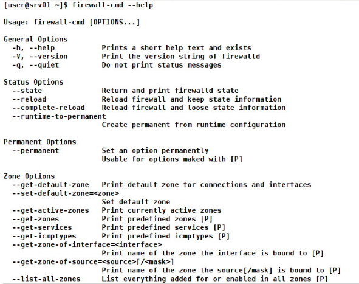

**Возможности SSH**

Firewalld запускается как демон, новые правила добавляются без перезапуска и без сброса установленного файрвола. Изменения в конфигурации могут быть сделаны в любое время и применяются мгновенно: сохранять или применять изменения не требуется. Поддерживается IPv4, IPv6, автоматическая загрузка модулей ядра и сетевые зоны, определяющие уровень доверия соединений. Предоставляется простой интерфейс добавления правил для служб и приложений, белый список приложений, имеющих право менять правила. В настоящее время такую возможность поддерживает libvirt, Docker, fail2ban, Puppet, скрипт установки Virtuozzo и многие другие проекты. В репозитории YUM уже есть пакеты fail2ban-firewalld и puppet-firewalld, поэтому подключить их можно одной командой.

Firewalld предоставляет информацию о текущих настройках брандмауэра через D-Bus API, а также принимает изменения через D-Bus с использованием методов аутентификации PolicyKit. В качестве бэкенда используются iptables, ip6tables, ebtables, ipset и планируется nftables. Но сами правила, созданные непосредственно этими утилитами, firewalld не может разобрать, поэтому оба метода использовать нельзя.

Управление производится при помощи утилит командной строки firewall-cmd или графической firewall-config, позволяющей настроить все правила в удобной среде. Для помощи в миграции текущих правил iptables на firewalld используется утилита firewall-offline-cmd, по умолчанию считывающая /etc/sysconfig/system-config-firewall. В последних релизах появилась утилита firewallctl, имеющая простой синтаксис и позволяющая получать информацию о состоянии службы, конфигурации брандмауэра и изменять правила.

https://xakep.ru/2017/02/15/firewalld/

