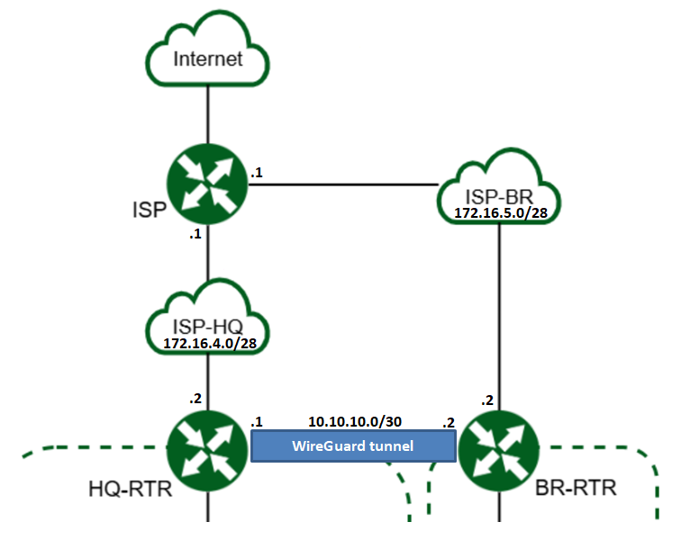
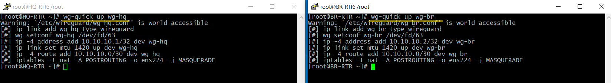
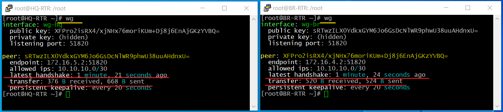
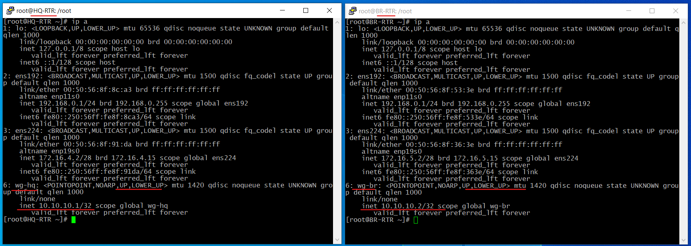

Примеры настройки WireGuard
############################

Пример 1
*********

Настроить между маршрутизаторами HQ-RTR и BR-RTR VPN туннель WireGuard. Адреса VPN - туннеля должны быть из сети 10.10.10.0/30 

**Настройка:**

1. Выполнить проверку настройку сетевых интерфейсов:

.. code::

	ip a

Между роутерами должны проходить пакеты (connectivity).

В данном случае через интерфейс ens224 трафик направляется во внешнюю сеть, поэтому в дальнейшем он будет использоваться в ноастойках
конфигурационных файлов.

1. Выполнить установку необходимых пакетов на оборудование(HQ-RTR, BR-RTR):

.. code::

	apt-get install wireguard-tools wireguard-tools-wg-quick kernel-source-wireguard

2. Создать каталоги **/etc/wireguard** и **/etc/wireguard/keys**

.. code::

	mkdir /etc/wireguard
	mkdir /etc/wireguard/keys
	
3. Перейти в каталог **/etc/wireguard/keys**:

..code::
	
	cd /etc/wireguard/keys
	
4. Сгенерировать приватный и публичный ключ:

.. code ::

	wg genkey | tee private.key | wg pubkey | tee public.key
	
Здесь генерируется приватный ключ **wg genkey** и командой **tee** направляется в файл **private.key**, затем он передается на вход **wg pubkey**, генерирующей на его основе 
публичный ключ и командой **tee** записывается в **public.key**

5. Перейти в каталог **/etc/wireguard** и создать конфигурационные файлы **wg-hq.conf** и **wg-br.conf** на соответствующих маршрутизаторах:

.. code::
	
	cd /etc/wireguard/

**HQ-RTR:**

.. code::
	
	vim wg-hq.conf

.. code::

	[Interface]
	Address = 10.10.10.1/32
	ListenPort = 51820
	PrivateKey = <ПРИВАТНЫЙ_КЛЮЧ_HQ-RTR>
	PostUp = iptables -t nat -A POSTROUTING -o ens224 -j MASQUERADE
	PostDown = iptables -t nat -D POSTROUTING -o ens224 -j MASQUERADE
	
	[Peer]
	PublicKey = <ПУБЛИЧНЫЙ_КЛЮЧ_BR-RTR>
	AllowedIPs = 10.10.10.0/30
	Endpoint = 172.16.5.2:51820
	PersistentKeepalive = 20
	
**BR-RTR:**

.. code::
	
	vim wg-br.conf

.. code::

	[Interface]
	Address = 10.10.10.2/32
	ListenPort = 51820
	PrivateKey = <ПРИВАТНЫЙ_КЛЮЧ_BR-RTR>
	PostUp = iptables -t nat -A POSTROUTING -o ens224 -j MASQUERADE
	PostDown = iptables -t nat -D POSTROUTING -o ens224 -j MASQUERADE
	
	[Peer]
	PublicKey = <ПУБЛИЧНЫЙ_КЛЮЧ_HQ-RTR>
	AllowedIPs = 10.10.10.0/30
	Endpoint = 172.16.5.1:51820
	PersistentKeepalive = 20
	
6. Поднять туннели на обоих серверах:

HQ-RTR:

.. code::

	wg-quick up wg-hq

BR-RTR:

.. code::

	wg-quick up wg-br

.. note:: **Примечание:** Выключить туннель можно командой: wg-quick down wg-hq

	   
7. Проверить активность туннелей командой **wg**:

.. code::

	wg
	

	   
Если присутствует "latest handshake:… seconds ago" и байты и в **received** и в **sent**, значит, все хорошо. 

Если байты только в **sent**, без **handshake** и **received**, значит, где-то в конфигурационном файле ошибка или серверы недоступны друг для друга.

Если в процессе включения туннеля произошла ошибка, то достаточно перезагрузить сервер — активные туннели сбросятся.

8. Проверить сетевые интерфейсы

..code::

	ip a
	

9. В случае отсутствия ошибок поставить туннели в автозапуск:

HQ-RTR:

.. code::

	systemctl enable wg-quick@wg-hq.service

BR-RTR:

.. code::

	systemctl enable wg-quick@wg-br.service

