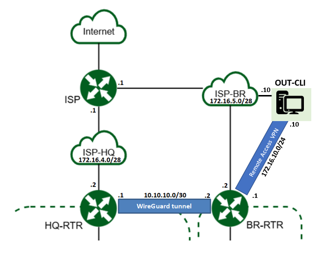
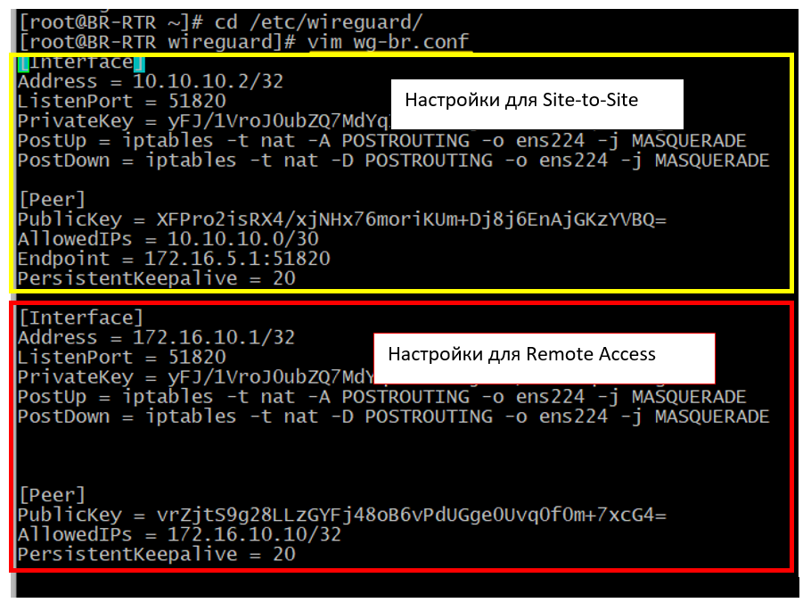
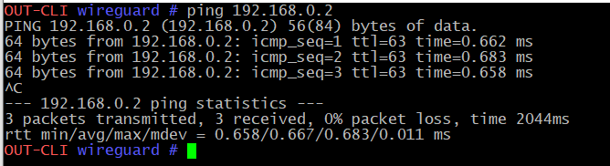

Примеры настройки WireGuard
############################

Пример "Site-to_Site VPN"
***************************

Настроить между маршрутизаторами HQ-RTR и BR-RTR Site-to_Site VPN туннель WireGuard. Адреса VPN - туннеля должны быть из сети 10.10.10.0/30 
 
Site-to_Site VPN - это VPN от маршрутизатора к маршрутизатору. В VPN Site-to_Site не разрешено использовать несколько пользователей.

.. figure:: img/wg_00.png
       :scale: 50 %
       :align: center
       :alt: asda

**Настройка:**

1. Выполнить проверку настройку сетевых интерфейсов:

.. code::

	ip a

Между роутерами должны проходить пакеты (connectivity).

В данном случае через интерфейс ens224 трафик направляется во внешнюю сеть, поэтому в дальнейшем он будет использоваться в ноастойках
конфигурационных файлов.

1. Выполнить установку необходимых пакетов на оборудование(HQ-RTR, BR-RTR):

.. code::

	apt-get install wireguard-tools wireguard-tools-wg-quick kernel-source-wireguard

2. Создать каталоги **/etc/wireguard** и **/etc/wireguard/keys**

.. code::

	mkdir /etc/wireguard
	mkdir /etc/wireguard/keys
	
3. Перейти в каталог **/etc/wireguard/keys**:

..code::
	
	cd /etc/wireguard/keys
	
4. Сгенерировать приватный и публичный ключ:

.. code ::

	wg genkey | tee private.key | wg pubkey | tee public.key
	
Здесь генерируется приватный ключ **wg genkey** и командой **tee** направляется в файл **private.key**, затем он передается на вход **wg pubkey**, генерирующей на его основе 
публичный ключ и командой **tee** записывается в **public.key**

5. Перейти в каталог **/etc/wireguard** и создать конфигурационные файлы **wg-hq.conf** и **wg-br.conf** на соответствующих маршрутизаторах:

.. code::
	
	cd /etc/wireguard/

**HQ-RTR:**

.. code::
	
	vim wg-hq.conf

.. code::

	[Interface]
	Address = 10.10.10.1/32
	ListenPort = 51820
	PrivateKey = <ПРИВАТНЫЙ_КЛЮЧ_HQ-RTR>
	PostUp = iptables -t nat -A POSTROUTING -o ens224 -j MASQUERADE
	PostDown = iptables -t nat -D POSTROUTING -o ens224 -j MASQUERADE
	
	[Peer]
	PublicKey = <ПУБЛИЧНЫЙ_КЛЮЧ_BR-RTR>
	AllowedIPs = 10.10.10.0/30
	Endpoint = 172.16.5.2:51820
	PersistentKeepalive = 20
	
**BR-RTR:**

.. code::
	
	vim wg-br.conf

.. code::

	[Interface]
	Address = 10.10.10.2/32
	ListenPort = 51820
	PrivateKey = <ПРИВАТНЫЙ_КЛЮЧ_BR-RTR>
	PostUp = iptables -t nat -A POSTROUTING -o ens224 -j MASQUERADE
	PostDown = iptables -t nat -D POSTROUTING -o ens224 -j MASQUERADE
	
	[Peer]
	PublicKey = <ПУБЛИЧНЫЙ_КЛЮЧ_HQ-RTR>
	AllowedIPs = 10.10.10.0/30
	Endpoint = 172.16.5.1:51820
	PersistentKeepalive = 20
	
6. Поднять туннели на обоих серверах:

HQ-RTR:

.. code::

	wg-quick up wg-hq

BR-RTR:

.. code::

	wg-quick up wg-br

.. figure:: img/wg_01.png
       :scale: 50 %
       :align: center
       :alt: asda

.. note:: **Примечание:** Выключить туннель можно командой: wg-quick down wg-hq

	   
7. Проверить активность туннелей командой **wg**:

.. code::

	wg
	
.. figure:: img/wg_02.png
       :scale: 50 %
       :align: center
       :alt: asda
	   
Если присутствует "latest handshake:… seconds ago" и байты и в **received** и в **sent**, значит, все хорошо. 

Если байты только в **sent**, без **handshake** и **received**, значит, где-то в конфигурационном файле ошибка или серверы недоступны друг для друга.

Если в процессе включения туннеля произошла ошибка, то достаточно перезагрузить сервер — активные туннели сбросятся.

8. Проверить сетевые интерфейсы

..code::

	ip a
	
.. figure:: img/wg_03.png
       :scale: 50 %
       :align: center
       :alt: asda

9. В случае отсутствия ошибок поставить туннели в автозапуск:

HQ-RTR:

.. code::

	systemctl enable wg-quick@wg-hq.service

BR-RTR:

.. code::

	systemctl enable wg-quick@wg-br.service

Пример "Remote access VPN"
**************************

В **Remote access VPN** (VPN с удалённым доступом) пользователи подключаются к частным сетям, и это позволяет механически удалённо получать доступ к сервисам и использовать эту частную сеть. 
Это лучше всего подходит для деловых и домашних целей.
При использовании VPN c удаленным доступом разрешено использовать несколько пользователей.

Для хоста OUT-CLI настроить Remote access VPN к маршрутизатору BR-RTR. 
Для клиента использовать адрес из сети 172.16.10.0/24

1. Проверить настройки хоста OUT - CLI

2. Установить необходимое программное обеспечение:

.. code::

	apt-get install wireguard-tools wireguard-tools-wg-quick kernel-source-wireguard
	
3. Создать каталог для ключей клиента (см. п.п. 2 - 4, Пример 1)

4. В каталоге **/etc/wireguard** cоздать конфигурационный файл **wg0-client.conf** для клиента OUT-CLI:

.. code::

	cd /etc/wireguard
	vim wg0-client.conf
	
.. code::
	
	[Interface]
	PrivateKey = <ПРИВАТНЫЙ_КЛЮЧ_OUT-CLI>
	Address = 172.16.10.10/32

	[Peer]
	PublicKey = <ПУБЛИЧНЫЙ_КЛЮЧ_BR-RTR>
	AllowedIPs = 172.16.10.0/24, 192.168.0.0/24
	Endpoint = 172.16.5.2:51820
	PersistentKeepalive = 20

* Address = 172.16.10.10/32 - IP адрес клиента в теннеле
* AllowedIPs = 172.16.10.0/24, 192.168.0.0/24

172.16.10.0/24 - сеть туннеля. Из этой сети *разрешать* доступ

192.168.0.0/24 - Из этой сети *разрешать* доступ и пакеты, направляемые в эту сеть передавать через туннель.

* Endpoint = 172.16.5.2:51820 - ip адрес сервера VPN (BR-RTR)
* PersistentKeepalive = 20 - каждые 2 секунд выполнять handshake для поддержания связи.

5. На BR-RTR внести изменения в файл **wg-br.conf**

Добавить в конец файла два раздела:

.. code::

	[Interface]
	Address = 172.16.10.1/32
	ListenPort = 51820
	PrivateKey = <ПРИВАТНЫЙ_КЛЮЧ_BR-RTR>

	[Peer]
	PublicKey = <ПУБЛИЧНЫЙ_КЛЮЧ_OUT-CLI>
	AllowedIPs = 172.16.10.10/32
	PersistentKeepalive = 20
	

6. На обоих устройствах запустить туннель:

BR-RTR:

.. code::

	wg-quick down wg-br
	wg-quick up wg-br

OUT-CLI:

.. code::

	wg-quick down wg0-client
	wg-quick up wg0-client

7. Проверить состояние туннеля:

.. code::

	wg
	
8. При отсутствии ошибок поставить туннели в автозапуск:

OUT-CLI:

.. code::

	systemctl enable wg-quick@wg0-client.service
	
9. Можно с OUT-CLI получать доступ к инфраструктуре за BR-RTR:

.. code::

	ping 192.168.0.2
	
